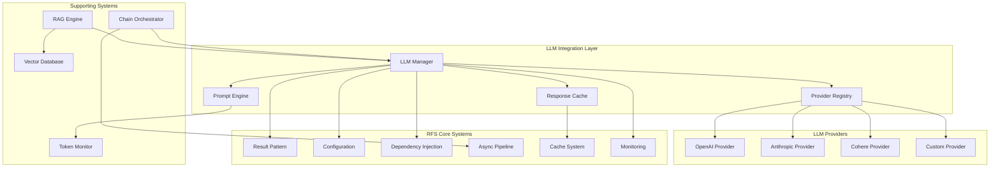

# RFS Framework LLM 통합 가이드

## 개요

RFS Framework에 LLM(Large Language Model) 통합 기능을 구현하기 위한 완전한 가이드입니다. 현재 미구현 상태이므로, 이 문서는 설계부터 구현까지의 전체 로드맵을 제공합니다.

## 현재 상태 분석

### ✅ 기존 구현된 기능
- **Result Pattern**: 모든 에러 처리를 위한 핵심 패턴
- **HOF Library**: 함수형 프로그래밍 패턴
- **Async Pipeline**: 비동기 작업 처리
- **Configuration System**: 환경별 설정 관리
- **Dependency Injection**: 서비스 등록 및 주입
- **Monitoring & Logging**: 관찰 가능성 도구들

### ❌ 미구현된 LLM 기능
- LLM Provider 통합 (OpenAI, Anthropic, etc.)
- 프롬프트 템플릿 관리 시스템
- 응답 캐싱 및 최적화
- 토큰 사용량 모니터링
- LLM 체인 및 파이프라인
- 벡터 데이터베이스 통합
- RAG (Retrieval Augmented Generation) 구현

## LLM 모듈 아키텍처 설계



## 구현 계획

### Phase 1: 핵심 LLM 모듈 구현

#### 1.1 LLM Provider 추상화
```python
# src/rfs/llm/providers/base.py
from abc import ABC, abstractmethod
from typing import Dict, List, Optional, Any
from rfs.core.result import Result
from rfs.hof.core import curry

class LLMProvider(ABC):
    """LLM Provider 기본 인터페이스"""
    
    @abstractmethod
    async def generate(
        self, 
        prompt: str, 
        model: str,
        **kwargs
    ) -> Result[str, str]:
        """텍스트 생성"""
        pass
    
    @abstractmethod
    async def embed(
        self, 
        text: str, 
        model: Optional[str] = None
    ) -> Result[List[float], str]:
        """텍스트 임베딩"""
        pass
    
    @abstractmethod
    def get_token_count(self, text: str, model: str) -> int:
        """토큰 수 계산"""
        pass
```

#### 1.2 Provider 구현체들
```python
# src/rfs/llm/providers/openai.py
from openai import AsyncOpenAI
from rfs.llm.providers.base import LLMProvider
from rfs.core.result import Result, Success, Failure

@stateless
class OpenAIProvider(LLMProvider):
    def __init__(self, api_key: str, base_url: Optional[str] = None):
        self.client = AsyncOpenAI(api_key=api_key, base_url=base_url)
    
    async def generate(self, prompt: str, model: str, **kwargs) -> Result[str, str]:
        try:
            response = await self.client.chat.completions.create(
                model=model,
                messages=[{"role": "user", "content": prompt}],
                **kwargs
            )
            return Success(response.choices[0].message.content)
        except Exception as e:
            return Failure(f"OpenAI API 호출 실패: {str(e)}")
    
    async def embed(self, text: str, model: str = "text-embedding-3-small") -> Result[List[float], str]:
        try:
            response = await self.client.embeddings.create(
                model=model,
                input=text
            )
            return Success(response.data[0].embedding)
        except Exception as e:
            return Failure(f"OpenAI 임베딩 실패: {str(e)}")
```

#### 1.3 LLM Manager 및 Registry
```python
# src/rfs/llm/manager.py
from typing import Dict, Optional, Any
from rfs.core.result import Result, Success, Failure
from rfs.core.annotations import stateless, inject
from rfs.llm.providers.base import LLMProvider
from rfs.hof.core import pipe, curry

@stateless
class LLMManager:
    """LLM 작업을 관리하는 중앙 매니저"""
    
    def __init__(self):
        self._providers: Dict[str, LLMProvider] = {}
        self._default_provider: Optional[str] = None
    
    def register_provider(self, name: str, provider: LLMProvider) -> Result[None, str]:
        """Provider 등록"""
        if name in self._providers:
            return Failure(f"Provider '{name}'가 이미 등록되어 있습니다")
        
        self._providers[name] = provider
        if self._default_provider is None:
            self._default_provider = name
        
        return Success(None)
    
    @curry
    async def generate_with_provider(
        self, 
        provider_name: str, 
        prompt: str, 
        model: str,
        **kwargs
    ) -> Result[str, str]:
        """특정 Provider로 텍스트 생성"""
        if provider_name not in self._providers:
            return Failure(f"Provider '{provider_name}'를 찾을 수 없습니다")
        
        provider = self._providers[provider_name]
        return await provider.generate(prompt, model, **kwargs)
    
    async def generate(
        self, 
        prompt: str, 
        model: str,
        provider: Optional[str] = None,
        **kwargs
    ) -> Result[str, str]:
        """텍스트 생성 (기본 Provider 사용)"""
        provider_name = provider or self._default_provider
        if not provider_name:
            return Failure("등록된 Provider가 없습니다")
        
        return await self.generate_with_provider(provider_name, prompt, model, **kwargs)
```

### Phase 2: 프롬프트 템플릿 시스템

#### 2.1 템플릿 엔진
```python
# src/rfs/llm/prompts/template.py
from typing import Dict, Any, Optional, List
from jinja2 import Template, Environment, BaseLoader
from rfs.core.result import Result, Success, Failure
from rfs.hof.core import pipe

class PromptTemplate:
    """프롬프트 템플릿 관리"""
    
    def __init__(self, template: str, name: Optional[str] = None):
        self.template = template
        self.name = name
        self._jinja_template = Template(template)
    
    def render(self, **kwargs) -> Result[str, str]:
        """템플릿 렌더링"""
        try:
            rendered = self._jinja_template.render(**kwargs)
            return Success(rendered)
        except Exception as e:
            return Failure(f"템플릿 렌더링 실패: {str(e)}")
    
    def validate_variables(self, variables: Dict[str, Any]) -> Result[None, str]:
        """템플릿 변수 유효성 검증"""
        try:
            # 템플릿에서 사용된 변수들 추출
            env = Environment()
            ast = env.parse(self.template)
            template_vars = set()
            
            for node in ast.find_all():
                if hasattr(node, 'name'):
                    template_vars.add(node.name)
            
            # 누락된 변수 확인
            missing_vars = template_vars - set(variables.keys())
            if missing_vars:
                return Failure(f"누락된 템플릿 변수들: {', '.join(missing_vars)}")
            
            return Success(None)
        except Exception as e:
            return Failure(f"변수 유효성 검증 실패: {str(e)}")

@stateless
class PromptTemplateManager:
    """프롬프트 템플릿 관리자"""
    
    def __init__(self):
        self._templates: Dict[str, PromptTemplate] = {}
    
    def register_template(self, name: str, template: str) -> Result[None, str]:
        """템플릿 등록"""
        try:
            prompt_template = PromptTemplate(template, name)
            self._templates[name] = prompt_template
            return Success(None)
        except Exception as e:
            return Failure(f"템플릿 등록 실패: {str(e)}")
    
    def get_template(self, name: str) -> Result[PromptTemplate, str]:
        """템플릿 조회"""
        if name not in self._templates:
            return Failure(f"템플릿 '{name}'를 찾을 수 없습니다")
        return Success(self._templates[name])
    
    async def render_and_generate(
        self,
        template_name: str,
        llm_manager: 'LLMManager',
        model: str,
        variables: Dict[str, Any],
        **kwargs
    ) -> Result[str, str]:
        """템플릿 렌더링 후 LLM 생성"""
        # HOF 파이프라인 사용
        return await pipe(
            lambda: self.get_template(template_name),
            lambda template_result: template_result.bind(
                lambda template: template.validate_variables(variables).bind(
                    lambda _: template.render(**variables)
                )
            ),
            lambda prompt_result: prompt_result.bind(
                lambda prompt: llm_manager.generate(prompt, model, **kwargs)
            )
        )()
```

### Phase 3: RAG (Retrieval Augmented Generation) 시스템

#### 3.1 벡터 데이터베이스 통합
```python
# src/rfs/llm/rag/vector_store.py
from abc import ABC, abstractmethod
from typing import List, Dict, Any, Optional
from rfs.core.result import Result
from rfs.hof.collections import compact_map

class VectorStore(ABC):
    """벡터 스토어 추상 인터페이스"""
    
    @abstractmethod
    async def add_documents(
        self, 
        documents: List[Dict[str, Any]]
    ) -> Result[List[str], str]:
        """문서 추가"""
        pass
    
    @abstractmethod
    async def similarity_search(
        self,
        query: str,
        k: int = 5,
        **kwargs
    ) -> Result[List[Dict[str, Any]], str]:
        """유사도 검색"""
        pass
    
    @abstractmethod
    async def delete_documents(self, ids: List[str]) -> Result[None, str]:
        """문서 삭제"""
        pass

@stateless
class ChromaVectorStore(VectorStore):
    """ChromaDB 구현체"""
    
    def __init__(self, collection_name: str, persist_directory: Optional[str] = None):
        import chromadb
        
        if persist_directory:
            self.client = chromadb.PersistentClient(path=persist_directory)
        else:
            self.client = chromadb.EphemeralClient()
        
        self.collection = self.client.get_or_create_collection(
            name=collection_name
        )
    
    async def add_documents(self, documents: List[Dict[str, Any]]) -> Result[List[str], str]:
        """문서 추가"""
        try:
            ids = [doc.get("id", f"doc_{i}") for i, doc in enumerate(documents)]
            texts = [doc["content"] for doc in documents]
            metadatas = [doc.get("metadata", {}) for doc in documents]
            
            self.collection.add(
                documents=texts,
                metadatas=metadatas,
                ids=ids
            )
            
            return Success(ids)
        except Exception as e:
            return Failure(f"문서 추가 실패: {str(e)}")
    
    async def similarity_search(
        self,
        query: str,
        k: int = 5,
        **kwargs
    ) -> Result[List[Dict[str, Any]], str]:
        """유사도 검색"""
        try:
            results = self.collection.query(
                query_texts=[query],
                n_results=k,
                **kwargs
            )
            
            documents = []
            for i in range(len(results['ids'][0])):
                documents.append({
                    "id": results['ids'][0][i],
                    "content": results['documents'][0][i],
                    "metadata": results['metadatas'][0][i],
                    "distance": results['distances'][0][i] if results['distances'] else None
                })
            
            return Success(documents)
        except Exception as e:
            return Failure(f"유사도 검색 실패: {str(e)}")
```

#### 3.2 RAG Engine
```python
# src/rfs/llm/rag/engine.py
from typing import List, Dict, Any, Optional
from rfs.core.result import Result, Success, Failure
from rfs.core.annotations import stateless, inject
from rfs.llm.manager import LLMManager
from rfs.llm.rag.vector_store import VectorStore
from rfs.llm.prompts.template import PromptTemplateManager
from rfs.hof.core import pipe

@stateless
class RAGEngine:
    """RAG (Retrieval Augmented Generation) 엔진"""
    
    def __init__(
        self,
        llm_manager: LLMManager,
        vector_store: VectorStore,
        template_manager: PromptTemplateManager
    ):
        self.llm_manager = llm_manager
        self.vector_store = vector_store
        self.template_manager = template_manager
        
        # 기본 RAG 템플릿 등록
        self._register_default_templates()
    
    def _register_default_templates(self):
        """기본 RAG 템플릿 등록"""
        rag_template = """다음 컨텍스트를 기반으로 질문에 답변해주세요.

컨텍스트:

{{ doc.content }}
---


질문: {{ question }}

답변: 제공된 컨텍스트를 바탕으로 답변하겠습니다."""

        self.template_manager.register_template("rag_default", rag_template)
    
    async def query(
        self,
        question: str,
        model: str,
        k: int = 5,
        template_name: str = "rag_default",
        **kwargs
    ) -> Result[Dict[str, Any], str]:
        """RAG 기반 질의응답"""
        
        # 관련 문서 검색
        search_result = await self.vector_store.similarity_search(question, k=k)
        if search_result.is_failure():
            return search_result
        
        context_documents = search_result.unwrap()
        
        # 템플릿을 사용하여 프롬프트 생성 및 LLM 호출
        generation_result = await self.template_manager.render_and_generate(
            template_name=template_name,
            llm_manager=self.llm_manager,
            model=model,
            variables={
                "question": question,
                "context_documents": context_documents
            },
            **kwargs
        )
        
        if generation_result.is_failure():
            return generation_result
        
        answer = generation_result.unwrap()
        
        return Success({
            "answer": answer,
            "context_documents": context_documents,
            "question": question
        })
    
    async def add_knowledge(
        self,
        documents: List[Dict[str, Any]]
    ) -> Result[List[str], str]:
        """지식 베이스에 문서 추가"""
        return await self.vector_store.add_documents(documents)
```

### Phase 4: LLM 체인 및 워크플로우

#### 4.1 체인 시스템
```python
# src/rfs/llm/chains/base.py
from abc import ABC, abstractmethod
from typing import Dict, Any, List, Optional, Callable
from rfs.core.result import Result, Success, Failure
from rfs.hof.core import pipe, compose
from rfs.async_pipeline.async_result import AsyncResult

class LLMChain(ABC):
    """LLM 체인 기본 클래스"""
    
    @abstractmethod
    async def run(self, inputs: Dict[str, Any]) -> Result[Dict[str, Any], str]:
        """체인 실행"""
        pass
    
    def then(self, next_chain: 'LLMChain') -> 'SequentialChain':
        """체인 연결"""
        return SequentialChain([self, next_chain])
    
    def parallel(self, *chains: 'LLMChain') -> 'ParallelChain':
        """병렬 체인 실행"""
        return ParallelChain([self] + list(chains))

class SequentialChain(LLMChain):
    """순차 실행 체인"""
    
    def __init__(self, chains: List[LLMChain]):
        self.chains = chains
    
    async def run(self, inputs: Dict[str, Any]) -> Result[Dict[str, Any], str]:
        """체인들을 순차적으로 실행"""
        current_inputs = inputs
        
        for chain in self.chains:
            result = await chain.run(current_inputs)
            if result.is_failure():
                return result
            
            # 다음 체인의 입력으로 사용
            current_inputs = {**current_inputs, **result.unwrap()}
        
        return Success(current_inputs)

class ParallelChain(LLMChain):
    """병렬 실행 체인"""
    
    def __init__(self, chains: List[LLMChain]):
        self.chains = chains
    
    async def run(self, inputs: Dict[str, Any]) -> Result[Dict[str, Any], str]:
        """체인들을 병렬로 실행"""
        import asyncio
        
        try:
            tasks = [chain.run(inputs) for chain in self.chains]
            results = await asyncio.gather(*tasks)
            
            # 실패한 체인이 있는지 확인
            for result in results:
                if result.is_failure():
                    return result
            
            # 모든 결과 병합
            merged_outputs = inputs.copy()
            for result in results:
                merged_outputs.update(result.unwrap())
            
            return Success(merged_outputs)
            
        except Exception as e:
            return Failure(f"병렬 체인 실행 실패: {str(e)}")
```

### Phase 5: 모니터링 및 최적화

#### 5.1 토큰 사용량 모니터링
```python
# src/rfs/llm/monitoring/token_monitor.py
from typing import Dict, Any, Optional
from datetime import datetime, timedelta
from dataclasses import dataclass
from rfs.core.result import Result, Success, Failure
from rfs.core.annotations import stateless
from rfs.monitoring.metrics import MetricsCollector

@dataclass
class TokenUsage:
    """토큰 사용량 정보"""
    prompt_tokens: int
    completion_tokens: int
    total_tokens: int
    cost_estimate: float
    timestamp: datetime
    model: str
    provider: str

@stateless
class TokenMonitor:
    """토큰 사용량 모니터링"""
    
    def __init__(self, metrics_collector: MetricsCollector):
        self.metrics_collector = metrics_collector
        self._usage_history: List[TokenUsage] = []
        
        # 모델별 토큰 가격 (예시)
        self._token_prices = {
            "gpt-4": {"prompt": 0.00003, "completion": 0.00006},
            "gpt-3.5-turbo": {"prompt": 0.0000015, "completion": 0.000002},
            "claude-3-sonnet": {"prompt": 0.000003, "completion": 0.000015},
        }
    
    def record_usage(
        self,
        provider: str,
        model: str,
        prompt_tokens: int,
        completion_tokens: int
    ) -> Result[TokenUsage, str]:
        """토큰 사용량 기록"""
        try:
            total_tokens = prompt_tokens + completion_tokens
            
            # 비용 계산
            model_prices = self._token_prices.get(model, {"prompt": 0, "completion": 0})
            cost_estimate = (
                prompt_tokens * model_prices["prompt"] +
                completion_tokens * model_prices["completion"]
            )
            
            usage = TokenUsage(
                prompt_tokens=prompt_tokens,
                completion_tokens=completion_tokens,
                total_tokens=total_tokens,
                cost_estimate=cost_estimate,
                timestamp=datetime.now(),
                model=model,
                provider=provider
            )
            
            self._usage_history.append(usage)
            
            # 메트릭 수집
            self.metrics_collector.increment_counter(
                "llm_api_calls",
                tags={"provider": provider, "model": model}
            )
            self.metrics_collector.record_histogram(
                "llm_token_usage",
                total_tokens,
                tags={"provider": provider, "model": model}
            )
            self.metrics_collector.record_histogram(
                "llm_cost_estimate",
                cost_estimate,
                tags={"provider": provider, "model": model}
            )
            
            return Success(usage)
            
        except Exception as e:
            return Failure(f"토큰 사용량 기록 실패: {str(e)}")
    
    def get_usage_summary(
        self,
        time_window: Optional[timedelta] = None
    ) -> Result[Dict[str, Any], str]:
        """사용량 요약 정보"""
        try:
            cutoff_time = datetime.now() - (time_window or timedelta(days=30))
            recent_usage = [
                usage for usage in self._usage_history 
                if usage.timestamp >= cutoff_time
            ]
            
            if not recent_usage:
                return Success({
                    "total_tokens": 0,
                    "total_cost": 0.0,
                    "api_calls": 0,
                    "by_provider": {},
                    "by_model": {}
                })
            
            # 통계 계산
            total_tokens = sum(usage.total_tokens for usage in recent_usage)
            total_cost = sum(usage.cost_estimate for usage in recent_usage)
            api_calls = len(recent_usage)
            
            # Provider별 통계
            by_provider = {}
            for usage in recent_usage:
                if usage.provider not in by_provider:
                    by_provider[usage.provider] = {
                        "tokens": 0, "cost": 0.0, "calls": 0
                    }
                by_provider[usage.provider]["tokens"] += usage.total_tokens
                by_provider[usage.provider]["cost"] += usage.cost_estimate
                by_provider[usage.provider]["calls"] += 1
            
            # 모델별 통계
            by_model = {}
            for usage in recent_usage:
                if usage.model not in by_model:
                    by_model[usage.model] = {
                        "tokens": 0, "cost": 0.0, "calls": 0
                    }
                by_model[usage.model]["tokens"] += usage.total_tokens
                by_model[usage.model]["cost"] += usage.cost_estimate
                by_model[usage.model]["calls"] += 1
            
            return Success({
                "total_tokens": total_tokens,
                "total_cost": total_cost,
                "api_calls": api_calls,
                "by_provider": by_provider,
                "by_model": by_model,
                "time_window_days": time_window.days if time_window else 30
            })
            
        except Exception as e:
            return Failure(f"사용량 요약 생성 실패: {str(e)}")
```

## 구현 로드맵

### 📋 Phase 1: 핵심 인프라 (2-3주)
- [ ] LLM Provider 추상화 및 기본 구현체들
- [ ] LLM Manager 및 Registry 시스템
- [ ] 기본 설정 및 DI 통합
- [ ] 단위 테스트 작성

### 📋 Phase 2: 프롬프트 시스템 (1-2주)  
- [ ] 프롬프트 템플릿 엔진 구현
- [ ] 템플릿 관리자 및 변수 유효성 검증
- [ ] 템플릿 파이프라인 통합
- [ ] 템플릿 저장소 구현

### 📋 Phase 3: RAG 시스템 (3-4주)
- [ ] 벡터 데이터베이스 통합 (ChromaDB, Pinecone)
- [ ] 문서 임베딩 및 검색 시스템
- [ ] RAG Engine 구현
- [ ] 지식 베이스 관리 도구

### 📋 Phase 4: 고급 기능 (2-3주)
- [ ] LLM 체인 시스템 구현
- [ ] 병렬 및 순차 체인 지원
- [ ] 조건부 체인 및 라우팅
- [ ] 체인 모니터링 및 디버깅

### 📋 Phase 5: 최적화 및 모니터링 (1-2주)
- [ ] 토큰 사용량 모니터링
- [ ] 응답 캐싱 시스템
- [ ] 성능 최적화
- [ ] 대시보드 및 알림

## 설정 예시

### RFS Framework 설정 통합
```yaml
# config/development.yml
llm:
  providers:
    openai:
      api_key: "${OPENAI_API_KEY}"
      base_url: "https://api.openai.com/v1"
      default_model: "gpt-3.5-turbo"
      max_tokens: 1000
      temperature: 0.7
    
    anthropic:
      api_key: "${ANTHROPIC_API_KEY}"
      base_url: "https://api.anthropic.com"
      default_model: "claude-3-sonnet-20240229"
      max_tokens: 1000
      temperature: 0.7
  
  default_provider: "openai"
  
  cache:
    enabled: true
    ttl: 3600  # 1시간
    max_size: 1000
  
  monitoring:
    token_tracking: true
    cost_alerts:
      daily_limit: 50.0  # USD
      monthly_limit: 1000.0  # USD
  
  rag:
    vector_store:
      type: "chroma"
      persist_directory: "./data/vector_store"
      collection_name: "knowledge_base"
    
    embedding:
      provider: "openai"
      model: "text-embedding-3-small"
      chunk_size: 1000
      chunk_overlap: 200
```

### 사용법 예시
```python
# examples/llm_example.py
from rfs.core.config import get_config
from rfs.llm.manager import LLMManager
from rfs.llm.providers.openai import OpenAIProvider
from rfs.llm.prompts.template import PromptTemplateManager
from rfs.llm.rag.engine import RAGEngine
from rfs.llm.rag.vector_store import ChromaVectorStore

async def main():
    # LLM 매니저 설정
    llm_manager = LLMManager()
    
    # Provider 등록
    openai_provider = OpenAIProvider(api_key=get_config("llm.providers.openai.api_key"))
    await llm_manager.register_provider("openai", openai_provider)
    
    # 기본 텍스트 생성
    result = await llm_manager.generate(
        prompt="Python에서 비동기 프로그래밍의 장점을 설명해주세요.",
        model="gpt-3.5-turbo"
    )
    
    if result.is_success():
        print(f"응답: {result.unwrap()}")
    
    # 템플릿 사용
    template_manager = PromptTemplateManager()
    template_manager.register_template(
        "code_review",
        "다음 {{language}} 코드를 리뷰해주세요:\n\n{{code}}\n\n개선사항:"
    )
    
    review_result = await template_manager.render_and_generate(
        template_name="code_review",
        llm_manager=llm_manager,
        model="gpt-3.5-turbo",
        variables={
            "language": "Python",
            "code": "def fibonacci(n): return n if n <= 1 else fibonacci(n-1) + fibonacci(n-2)"
        }
    )
    
    # RAG 사용
    vector_store = ChromaVectorStore("knowledge_base", "./data/vectors")
    rag_engine = RAGEngine(llm_manager, vector_store, template_manager)
    
    # 지식 베이스에 문서 추가
    documents = [
        {
            "id": "doc1",
            "content": "RFS Framework는 함수형 프로그래밍 패턴을 지원하는 Python 프레임워크입니다.",
            "metadata": {"type": "documentation", "category": "framework"}
        }
    ]
    await rag_engine.add_knowledge(documents)
    
    # RAG 기반 질의응답
    rag_result = await rag_engine.query(
        question="RFS Framework는 무엇인가요?",
        model="gpt-3.5-turbo"
    )
    
    if rag_result.is_success():
        response = rag_result.unwrap()
        print(f"RAG 응답: {response['answer']}")

if __name__ == "__main__":
    import asyncio
    asyncio.run(main())
```

## 주요 특징

### ✅ RFS Framework 통합
- **Result Pattern**: 모든 LLM 작업에서 명시적 에러 처리
- **HOF Library**: 함수형 패턴으로 LLM 파이프라인 구성
- **Configuration System**: 환경별 LLM 설정 관리
- **Dependency Injection**: 서비스 기반 아키텍처
- **Monitoring**: 토큰 사용량 및 성능 모니터링

### ⚡ 성능 최적화
- **비동기 처리**: 모든 LLM 호출이 비동기
- **응답 캐싱**: 중복 요청 최적화
- **병렬 처리**: 복수 LLM 호출 동시 실행
- **토큰 최적화**: 사용량 모니터링 및 알림

### 🛡️ 보안 및 안정성
- **API 키 관리**: 환경 변수를 통한 보안 설정
- **에러 처리**: Result 패턴으로 안전한 에러 관리
- **유효성 검증**: 입력 데이터 및 템플릿 검증
- **모니터링**: 사용량 추적 및 비용 관리

이 가이드를 따라 구현하면 RFS Framework에 완전히 통합된 엔터프라이즈급 LLM 모듈을 구축할 수 있습니다.